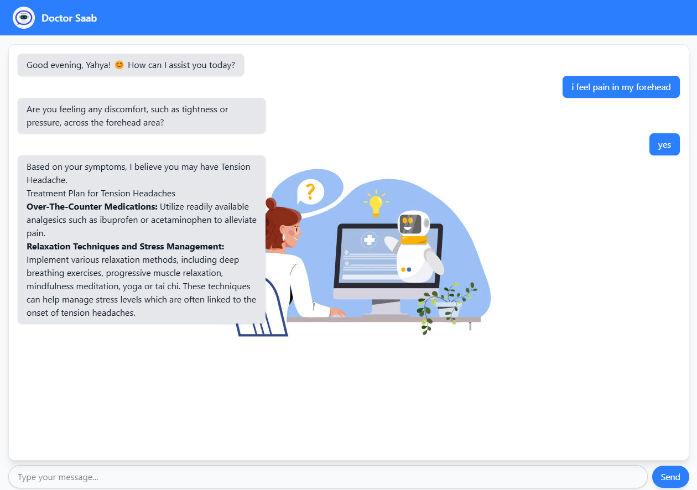

# Doctor Saab - Medical Assistant Chatbot

 <!-- Add a screenshot if available -->

A symptom analysis chatbot leveraging Retrieval-Augmented Generation (RAG) to provide potential diagnoses and treatment suggestions. Built with modern AI technologies and a modular architecture.

## Features

- **Symptom Analysis**: Natural language processing for patient symptom input
- **Dynamic Counter-Questions**: Context-aware follow-up questions for accurate diagnosis
- **Treatment Recommendations**: Evidence-based treatment suggestions
- **Local AI Processing**: Phi-3-mini LLM running locally via GPT4All
- **Vector Knowledge Base**: ChromaDB storage for medical data with Nomic embeddings

## Tech Stack

**Frontend**  
React.js | Tailwind CSS | Axios

**Backend**  
Python Flask | GPT4All | Nomic-Embed-Text

**AI/ML**  
RAG Architecture | Phi-3-mini-4k-instruct | ChromaDB

## Installation

### Prerequisites
- Node.js v18+
- Python 3.10+
- GPT4All binary (install from [official site](https://gpt4all.io))

## Setting Up The Project
### 1. Clone repository
   ```bash
   git clone https://github.com/yourusername/doctor-saab.git
   cd doctor-saab/backend